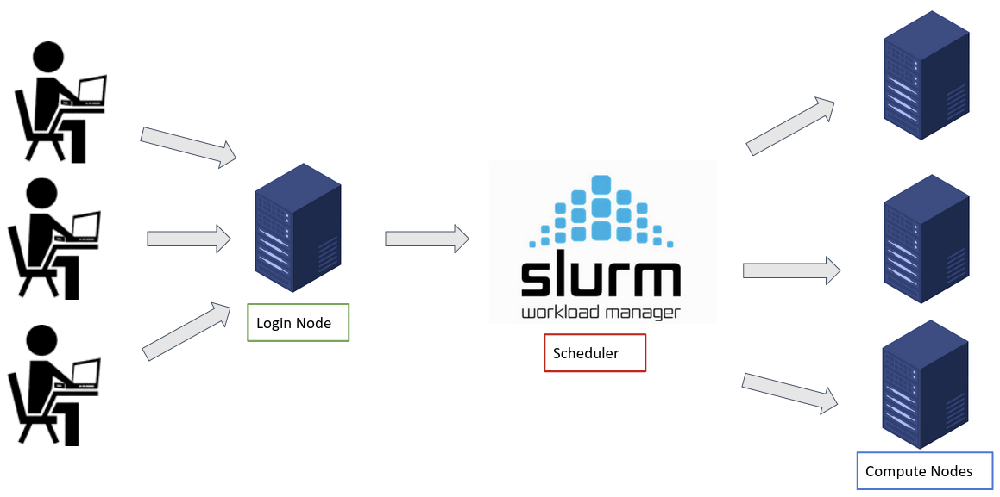

# How to acces Milton
----------------------------------------------------------------
## Table of Contents
- [How to acces Milton](#how-to-acces-milton)
  - [Table of Contents](#table-of-contents)
  - [What's Milton](#whats-milton)
  - [Connecting to Milton](#connecting-to-milton)
    - [Log in from the command-line](#log-in-from-the-command-line)
    - [Log in from your browser](#log-in-from-your-browser)
  - [Resources](#resources)

----------------------------------------------------------------

## What's Milton

Milton is WEHI's High-Performance Computer (HPC) cluster. To make it quick and painless, clusters are collections of computers networked together with software installed ensuring coordinations amongst them. Each computer in the cluster is referred as a node and you can have different type of nodes depending on their functions, eg:

1. Login (or headhpc-architecture) node &rarr the computer where you land when you log in into the cluster. You generally use this node to edit your scripts, navigate through directories, retrieve files etc.. ** you dont run scripts on this node**
2. Compute node &rarr the computer(s) where you run all your jobs

The above mentioned software installed across the cluster that allows for managing the network is [SLURM](https://slurm.schedmd.com/documentation.html) (Simple Linux Utility for Resource Management). SLURM is an open source workload manager that allows to submit jobs from the login node to the compute node(s) as well as schedule them by using a queuing system. Below you have a schematic overview of what's an HPC.



## Connecting to Milton

Assuming you are using a WEHI laptop/desktop you should be able to access Milton through the command line via SSH (Secure Shell) while connected to the staff network, or upon activating the VPN (GlobalProtect) when connected to external networks. From non-WEHI devices, Milton is only accessible via the [Open OnDemand portal](https://ondemand.hpc.wehi.edu.au/) and [RAP](https://rap.wehi.edu.au/)(Remote Access Portal)

### Log in from the command-line

On a WEHI Mac run the following:

```

ssh vc7-shared ## and press enter after typing your password

```
On a WEHI Windows machine, if you have Windows 10 or 11 you may first need to enable OpenSSH ([see instructions](https://wehieduau.sharepoint.com/sites/rc2/SitePages/using-milton.aspx#:~:text=instructions%20on%20Microsoft%20Documentation)). Then open a Command Prompt (from the search bar) and run `ssh vc7-shared`.

Upon successfully logged in you will see something like this, which means you are now connected to the HPC login node. Remember that this node is not supposed to be used for running jobs but only to navigate through the cluster and to submit jobs to the computing nodes.

```
____________________________________________________________
|                                                          |
|                 Welcome to vc7-shared!                   |
|                                                          |
|    This is a shared service, please consider what        |
|    you are running.                                      |
|                                                          |
|    Resource limits are enforced in this server:          |
|                                                          |
|    4 CPUs                                                |
|    24 GB of memory                                       |
|                                                          |
|    Processes exceeding the memory limit will be          |
|    automatically terminated.                             |
|                                                          |
|    For Research Computing documentation please visit:    |
|                                                          |
|    https://wehieduau.sharepoint.com/sites/rc2            |
|__________________________________________________________|


Last login: Tue Apr 16 09:35:08 AEST 2024 from mac4184.wehi.edu.au on pts/40
```

### Log in from your browser
Open OnDemand provides easy web access the HPC. From there you can then have access to 1) command-line shell and 2) SLURM job management. You can also open an RStudio session or a Jupyter notebook.
To access Milton from Open OnDemand you need to login at [ondemand.hpc.wehi.edu.au](https://ondemand.hpc.wehi.edu.au/) which will look like the one below


Enter just your username (not the full email address) and password and, once successfully logged in, you will be prompted to the home page which will look like the one below


From here you can start navigating through the Milton cluster, start an RStudio session, submitting jobs etc.. by clicking on the tabs on the top bar.


## Resources
Below you can find a list of resources either from WEHI or from other sources on what is HPC, SLURM, commands etc..
* [Connecting to Milton](https://wehieduau.sharepoint.com/sites/rc2/SitePages/using-milton.aspx)
* [Getting started with SLURM](https://wehieduau.sharepoint.com/sites/rc2/SitePages/Getting-started-Slurm.aspx)
* [SLURM partitions @ WEHI](https://wehieduau.sharepoint.com/sites/rc2/SitePages/SLURM-partitions.aspx)
* [SLURM commands](https://www.arch.jhu.edu/support/slurm-queueing-system/#:~:text=SLURM%20uses%20%E2%80%9Cpartitions%E2%80%9D%20to%20divide,default%20partition%20is%20%E2%80%9Cparallel%E2%80%9D.)
