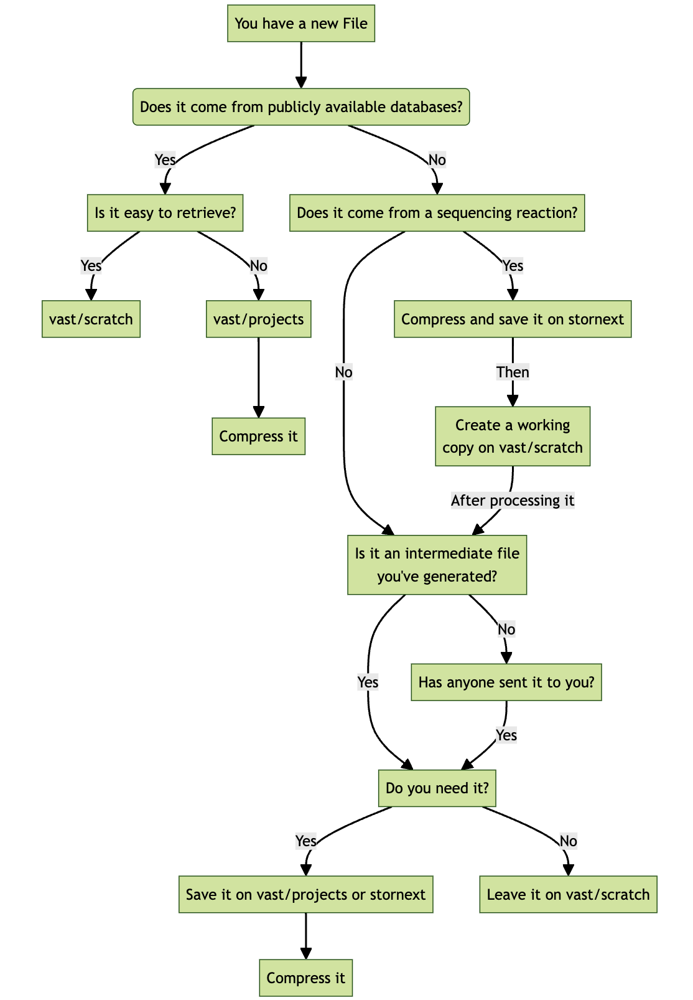

# Managing sequencing data
----------------------------------------------------------------
## Table of Contents
- [Managing sequencing data](#managing-sequencing-data)
  - [Table of Contents](#table-of-contents)
- [Where to start](#where-to-start)
  - [Workflow](#workflow)
  - [Examples](#examples)

----------------------------------------------------------------

# Where to start

So you sent some samples to be sequenced and got the results? Cool, then check the instructions and the workflow chart below as they contain information on how data is managed within the King lab. <br/>
If you need a refresher on the different file systems available on Milton and how they work you can check the documentation available at `docs/managing-files-and-disk-quota.md` still in this repository.


## Workflow 


## Examples

The table below gives you an overview on where to store the different files on the HPC depending on their type and/or their source.

| **Data**        	| **Type**     	| **Source**                                       	| **File example** 	| **Store**                     	| **Compress** 	| **Tar**    	|
|-----------------	|--------------	|--------------------------------------------------	|------------------	|-------------------------------	|--------------	|------------	|
| Public          	| Raw          	| Public repository accessible through script      	| Fastq            	| `vast/scratch`                	| No need      	| No need    	|
| Public          	| Raw          	| Public repository accessible through application 	| Fastq            	| `vast/project`                	| Yes          	| Preferably 	|
| Newly generated 	| Raw          	| Sequencing facilities                            	| Fastq            	| `storenext`                   	| Yes          	| Preferably 	|
| Intermediate    	| Preprocessed 	| Generate with custom scripts                     	| Bam              	| `vast/scratch`                	| No need      	| No need    	|
| Final           	| Preprocessed 	| Generate with custom scripts                     	| Bed, bigWig      	| `vast/project`<br>`storenext` 	| Yes          	| Preferably 	|


On stornext:
* Compress large files using the `pigz` module (a faster/parallel version of `gzip`) as:
```
module load pigz/ 

pigz --fast <file?> ## for fast compression 
pigz --best <file? ## slower but achieves better compression

```
* store large directories as tar files (and compress them)

